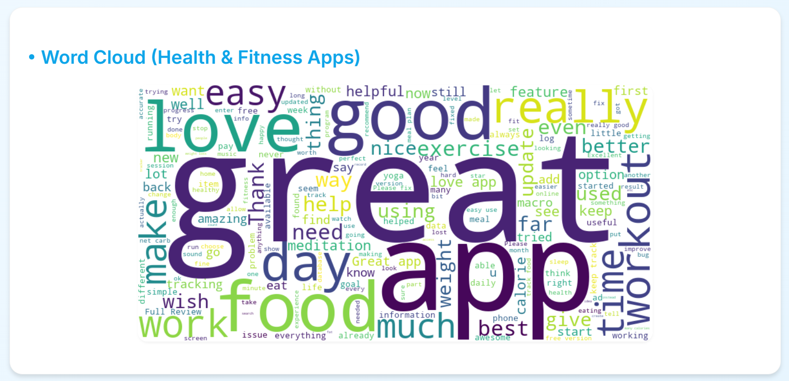
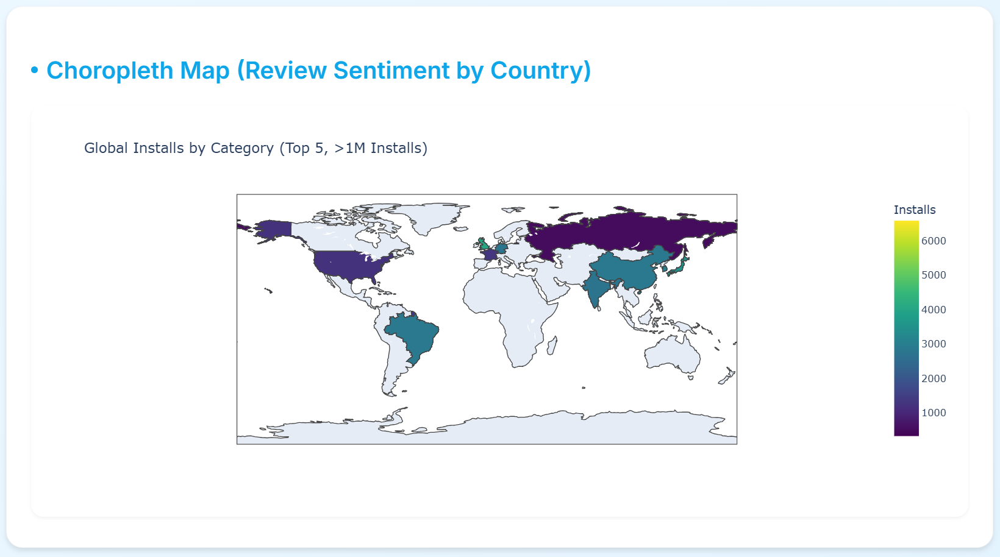
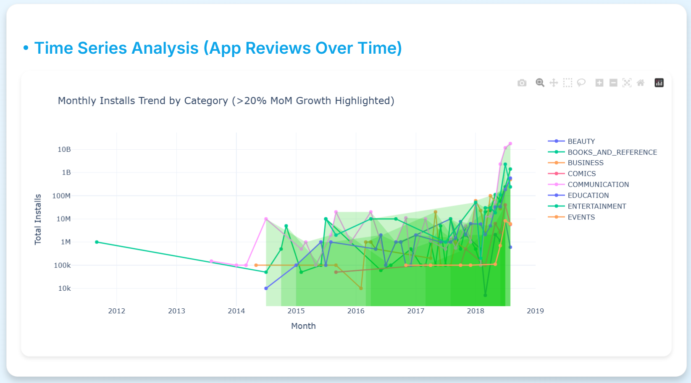

# Play Store Data Analytics 📱

## Overview
A comprehensive data analytics project focused on analyzing Google Play Store data to gain insights into app trends, user preferences, and market dynamics. This project helps understand what makes an app successful in the Play Store ecosystem.

## Features ✨
- Generates a word cloud from 5-star reviews for Health & Fitness apps.
- Displays a choropleth map of global installs for top 5 app categories.
- Highlights categories with over 1 million installs, excluding A, C, G, and S.
- Choropleth map is visible only between 6 PM and 8 PM IST.
- Plots time series of installs by month segmented by app category.
- Filters apps by category (E, C, B), reviews > 500, and name not starting with x, y, or z.
- Time series graph is visible only between 6 PM and 9 PM IST.
- Time-based gating implemented using current IST.

## Screenshots 📸

### Word Cloud Analysis

*Word cloud showing most common terms in positive reviews for Health & Fitness apps*

### Global App Distribution

*Interactive choropleth map showing global app installs distribution*

### Time Series Analysis

*Monthly installs trend analysis with growth highlights*

## Technologies Used 🛠
- Python
- Pytz
- NumPy
- Plotly

## Installation 📥
1. Clone the repository:
```bash
git clone https://github.com/yourusername/Play-Store-Data-Analytics.git
```

2. Navigate to the project directory:
```bash
cd Play-Store-Data-Analytics
```

3. Install required dependencies:
```bash
pip install -r requirements.txt
```

## Data Sources 📊
The project uses the Google Play Store dataset which includes:
- App details
- Ratings and reviews
- Size and installs
- Price and content rating
- Category information


## Author 👨‍💻
- **Dhruv Amin**
